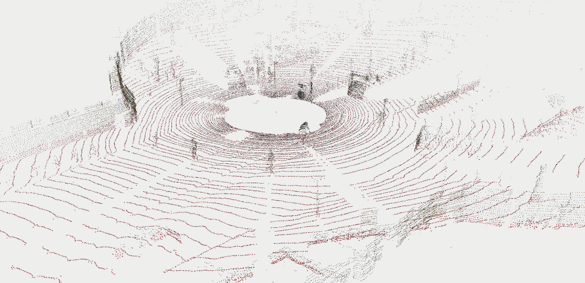
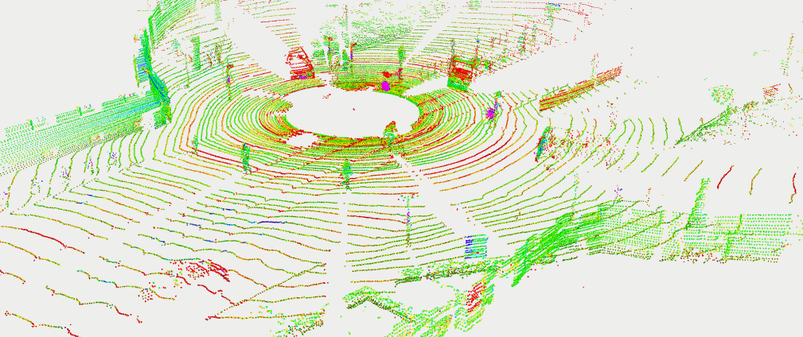
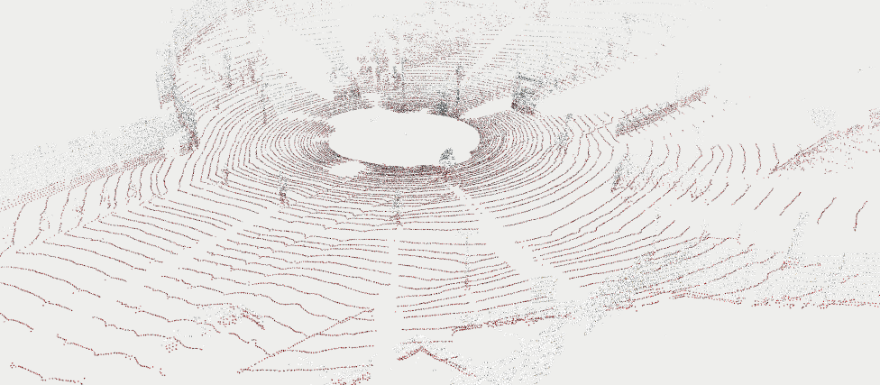
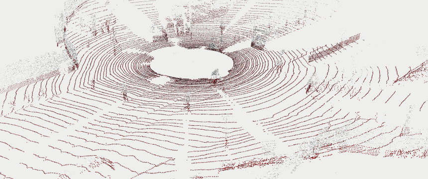

# LiDAR-Segmentation

 - Segmentation of point cloud data from LiDAR. 
 - The data is from udacity. I have used DBSCAN&RANSAC clustering, Voxel grid down sampling in the pipeline. 
 - There's a  for converting point cloud format between Open3D and ROS:   
    * convertCloudFromOpen3dToRos  
    * convertCloudFromRosToOpen3d

## Rviz Topic output:

### /plane_points

### /rslidar_points

### /sampled_points

### /segment_points

## Setup Locally:

 - Enter to project directory

  `cd LiDAR-Segmentation`

 - Source the workspace

  `source devel/setup.bash`

 - Run the launch files

  `roslaunch fcw_segment frame_pub.launch`

  `roslaunch fcw_segment main.launch`
  
 Nb:- If you Still got an error then remove `build` and `devel` folders and run the command `catkin_make`. Now follow the above steps
